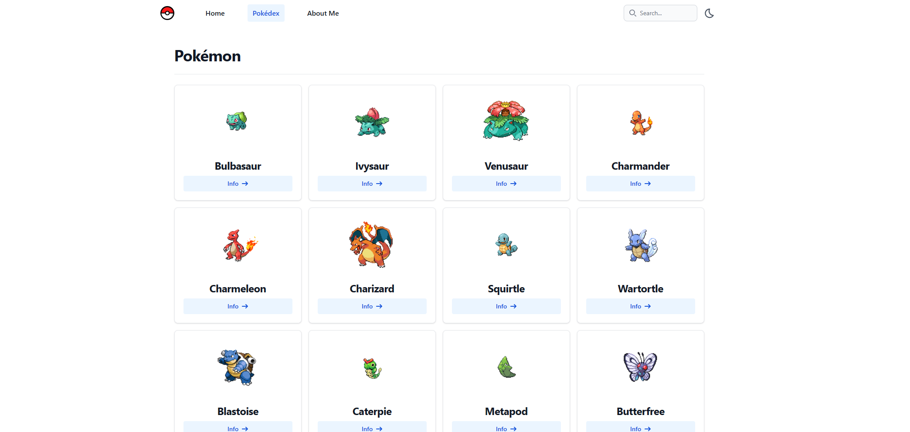

# Pokedex React App

This project is a simple Pokedex app, developed with React. This app allows you to view information about different Pokemon.



## Features

- Display details of Pokemon
- Search for Pokemon
- Responsive design

## Technologies

- React
- TypeScript
- Tailwind CSS
- Flowbite
- Headless Ui
- Tailwind Ui
- [PokeAPI](https://pokeapi.co/)

## Setup

To set up the project locally, follow these steps:

1. Clone the repository:

   ```sh
   git clone https://github.com/hundemit/Pokedex-React.git
   ```

2. Navigate to the project directory:

   ```sh
   cd pokedex-react
   ```

3. Install the dependencies:

   ```sh
   npm install
   ```

4. Start the app:
   ```sh
   npm start
   ```
